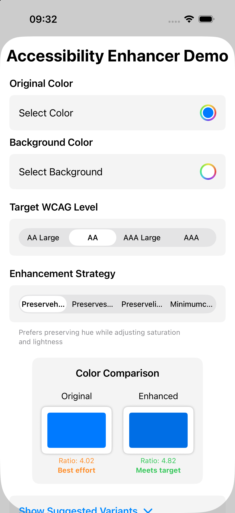
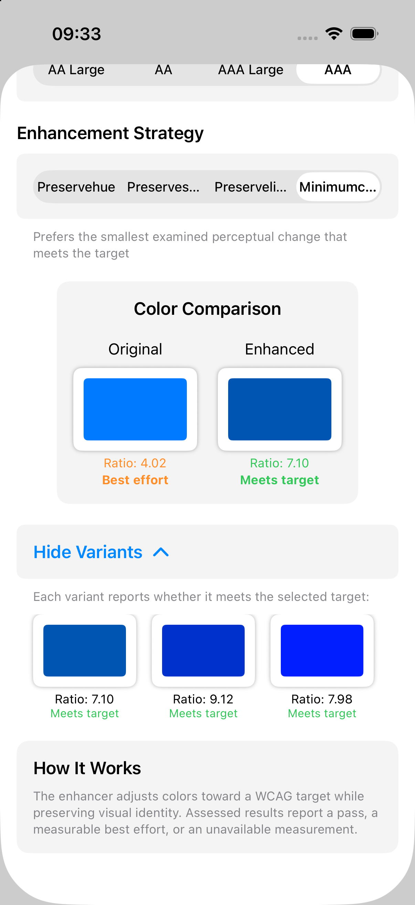

# Enhancement distance budget screenshots

Captured on 2026-09-04 from the existing `ColorKitDemo` app built against commit
`6edfab5`, using Xcode 26.5 and an iPhone 17 simulator running iOS 26.5.
These are unmodified simulator PNG captures, not mockups or injected UI states.

Open **Accessibility Enhancer** in the demo. Keep the initial opaque blue foreground,
white background, and default distance budget of 30.

## Preserve hue, AA

The updated strategy description says “Prefers preserving hue.” The original
contrast is 4.02 (best effort), and the enhanced result reaches 4.82 (meets target).

## Minimum change, AAA and variants

Select **AAA**, select **Minimumchange**, expand **Show Suggested Variants**, and
scroll down. The updated description scopes the strategy to the smallest examined
change. The enhanced result reaches 7.10; the three visible variants report their
measured contrast and passing status.

The demo does not expose an invalid-budget control, so these captures do not claim
to exercise `invalidConfiguration`. Invalid inputs, hard distance boundaries, and
unavailable diagnostics are covered by the public-API regression tests.
