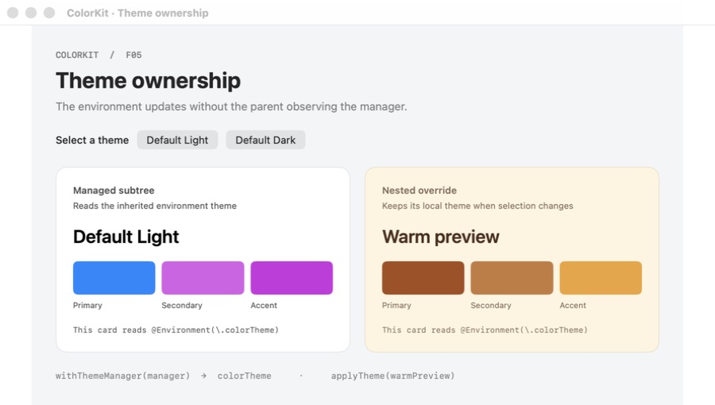
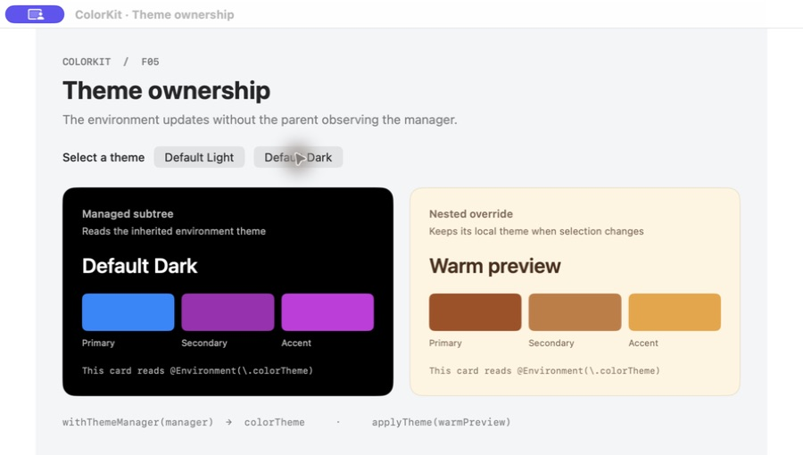

# F05 theme observation screenshots

Captured on macOS on 2026-08-31 from a temporary SwiftUI demo linked to this branch's ColorKit package. This is a demonstration of the library, not a new bundled app.

The same window stays mounted while the Default Dark button calls `ThemeManager.shared.switchToTheme(named:)`. The parent holds the manager as a plain constant, and the cards read only `@Environment(\.colorTheme)`. The provider updates the managed subtree; the nested `applyTheme(_:)` override keeps its Warm preview theme.

| Before: Default Light | After: Default Dark |
| --- | --- |
|  |  |
