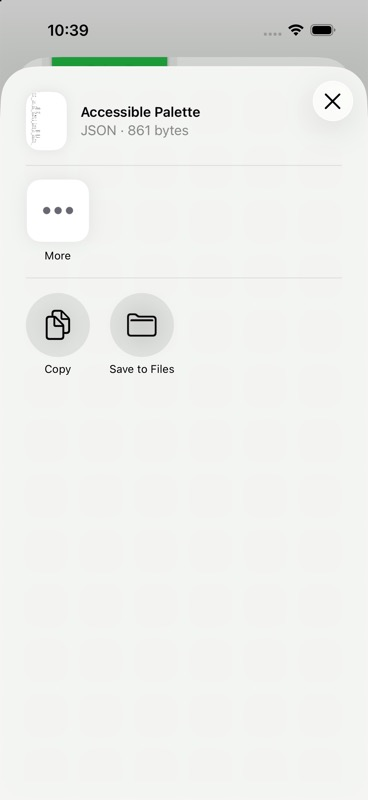
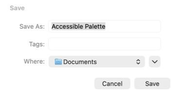
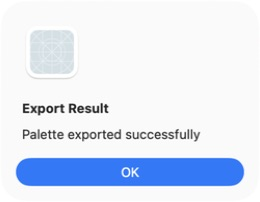
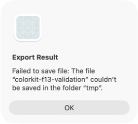

# F13 export lifecycle validation

The demo prepares one immutable export payload from a button action before opening the iOS share sheet or macOS save panel. Its controls and supported formats are unchanged.

## Automated checks

Using Xcode 26.5 on macOS and an iPhone 17 simulator running iOS 26.5:

- `AccessiblePaletteExportTests`: 12 lifecycle tests passed on each platform.
- `AccessiblePaletteExportPresentationTests`: the hosted demo redraw test passed on each platform.
- `PaletteExporterTests`: all 6 existing export tests passed on each platform.
- Strict SwiftLint passed.

The focused runs include the alert-state fix and the repeat-share test correction on top of `main` at `c3d5d6a`. The remaining native iOS checks were completed on `main` at `b3b8f7f`. This is focused export coverage; the full repository release gate is tracked separately.

The lifecycle tests cover preparation counts, ignored actions during sharing, captured inputs, preparation and write failures, retry, file retention after dismissal and owner release, unique request directories, cleanup across simulated app runs, and save cancellation/success/failure. The hosted test changes the color scheme while sharing and after dismissal, verifying no additional preparation and a stable file.

Reproduce the focused checks with the repository test runner, substituting an available simulator destination if necessary:

```sh
scripts/run_tests.sh macOS 'platform=macOS' \
  -only-testing:ColorKitTests/AccessiblePaletteExportTests \
  -only-testing:ColorKitTests/AccessiblePaletteExportPresentationTests \
  -only-testing:ColorKitTests/PaletteExporterTests \
  -parallel-testing-enabled NO -skipPackagePluginValidation -skipMacroValidation

scripts/run_tests.sh iOS 'platform=iOS Simulator,name=iPhone 17,OS=26.5' \
  -only-testing:ColorKitTests/AccessiblePaletteExportTests \
  -only-testing:ColorKitTests/AccessiblePaletteExportPresentationTests \
  -only-testing:ColorKitTests/PaletteExporterTests \
  -parallel-testing-enabled NO -skipPackagePluginValidation -skipMacroValidation

swiftlint lint --strict
```

## Native UI checks

- The existing iOS demo app builds and presents `Accessible Palette.json` in the system share sheet. The file exists in a unique request directory before presentation.
- A temporary native macOS host of `AccessiblePaletteDemoView` opens the save panel with the existing palette filename. Cancelling returns to the demo without an export result alert.
- Selecting PNG and Export Theme opens the save panel with `Generated Theme` as the suggested name.
- Saving a palette as JSON produces a valid file with the expected palette name and five entries, followed by the existing success message. A theme PNG save also produced a valid PNG file.
- A temporary macOS host injected a directory as the save destination to force a write failure. The demo's native alert displayed the save error text. This checks error presentation without changing the production save panel.
- Native checking exposed an empty result alert when the modifier captured an outdated message value. The modifier now observes the export helper and reads its current message when presenting the alert; success and error messages were rechecked in the native host.
- A temporary XCTest UI harness outside the repository completed two native iOS share-and-cancel cycles. Each dismissal restored enabled export actions, and each later action presented a fresh share sheet.
- The same harness used a temporary two-second delay in the demo's background generation to make the overlap deterministic. It observed the generating state, presented the native share sheet, observed generation complete while that sheet remained active, confirmed export actions stayed disabled during sharing, then dismissed the sheet and confirmed exporting became available again. The timing hook and harness were removed after validation.

## Review and corrections

- Separate Standards and Spec reviews found no implementation or scope defects. The Standards review's two organization findings were corrected; the Spec review identified the remaining native validation gap above.
- Cleanup compares app-run directory names rather than complete URLs, whose trailing-slash representations can differ.
- The repeated-export test compares each file with its own captured bytes. Separate JSON serializations may use different dictionary key orders, so byte equality between independently prepared artifacts is not a requirement.
- Both review axes rechecked the final alert-state and test corrections with no remaining findings. The later native XCTest pass closes the previously documented iOS validation gap.

## Screenshots

### iOS prepared JSON share



### macOS save panel



### macOS save success



### macOS save error


