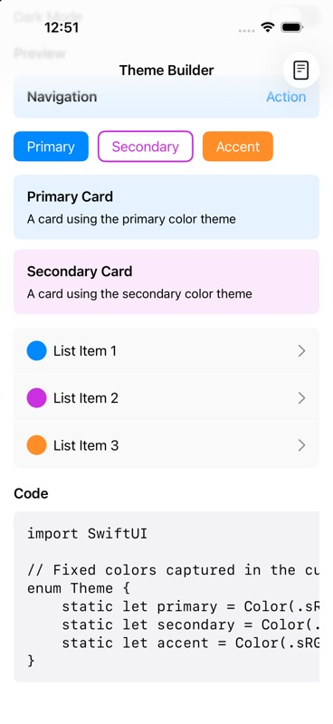

# Theme code generation

Captured on 2026-09-04 from `ThemePreview` at commit `692c625`, using an iPhone 17
simulator running iOS 26.5. The preview and generator source are unchanged after
rebasing onto HSL PR #52. This is a genuine simulator capture, saved by the capture
tool as a resized JPEG, not a mockup.

The demo app does not expose this preview, so it was hosted in a temporary SwiftUI
app with `NavigationStack { ThemePreview() }` and a local ColorKit dependency.
Open **Show Code** and scroll to the code panel. No repository application source
was changed for the capture.

The code panel scrolls horizontally; this capture shows the starts of the generated
declarations, not every component value. `scripts/check_documentation.py` separately
compiles the full generator output for named defaults and fixed translucent, Display
P3, and grayscale colors. The screenshot is visual evidence, not compilation proof.
